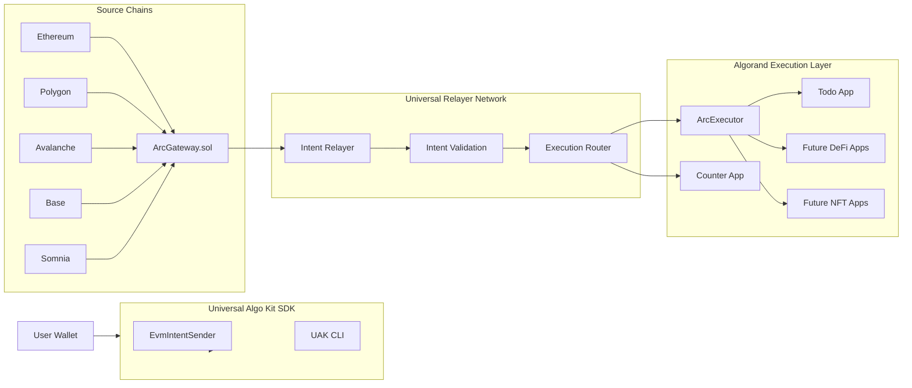
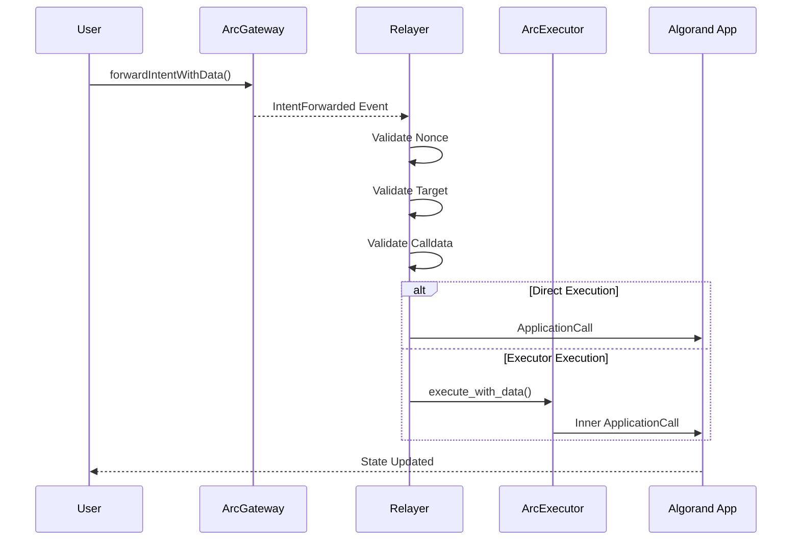
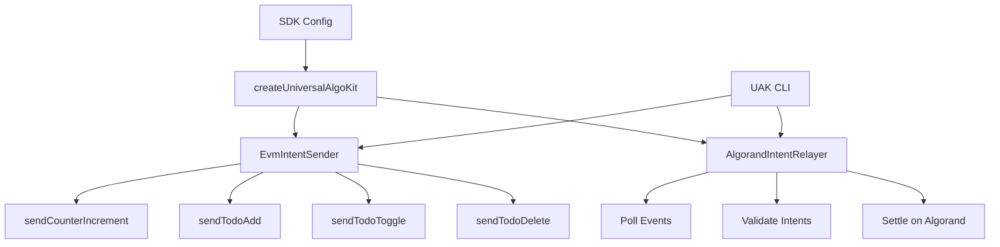
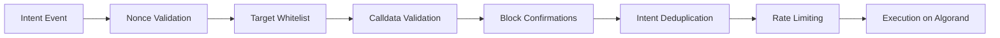

# Algorand-Somnia Cross-Chain SDK

> Cross-chain intent settlement from Somnia to Algorand with sub-5 second finality

## 🌟 Overview

This SDK enables users to send intents from Somnia (EVM chain) that are automatically settled on Algorand. The relayer detects events on Somnia and executes corresponding transactions on Algorand.


### Universal Algorand Kit - System Architecture


### Intent Execution Flow


### SDK Architecture




### Security Valication 



**Supported Apps:**
- ✅ **Counter** - Direct increment/decrement operations
- ✅ **TodoList** - Add, toggle, and delete todos via Executor pattern


## 📦 SDK Package (publishable)

This repo also contains a standalone, publishable npm package:

- Package source: `sdk/universal-algo-kit/`
- Docs: `sdk/universal-algo-kit/README.md`
- Architecture notes: `sdk/universal-algo-kit/docs/ARCHITECTURE.md`

Install (after you publish it under your scope/name):

```bash
npm i universal-algo-kit
# or (recommended) scoped name:
# npm i @<your-npm-username>/universal-algo-kit
```


## 📋 Prerequisites

- Node.js v18+ and npm
- Python 3.13+ (for Algorand contracts)
- AlgoKit CLI
- Hardhat
- Access to Somnia Testnet RPC
- Algorand Testnet access

## 🚀 Quick Start

### 1. Clone and Install

```bash
cd web3-hardhat-intent
npm install
```

### 3. Start the Relayer

```bash
npm run relayer
```

The relayer will:
- Listen for events on Somnia
- Detect Counter and TodoList intents
- Settle transactions on Algorand
- Log all activity

## 🧪 Testing

### Test Counter (Direct Call)

```bash
npx hardhat run scripts/test-flow.ts --network somniaTestnet
```

**Expected Output:**
```
✅ Intent sent!
   Tx: 0x...
   Block: ...
```

**Verify on Algorand:**
```bash
curl -s "https://testnet-api.algonode.cloud/v2/applications/762834496" | \
  jq '.params["global-state"][] | select(.key=="Y291bnRlcg==") | .value.uint'
```

### Test TodoList (via Executor)

```bash
npx hardhat run scripts/test-executor-fix.ts --network somniaTestnet
```

**Expected Output:**
```
✅ Intent sent!
   Tx: 0x...
   Block: ...
```

**Verify TodoList Box:**
```bash
curl -s "https://testnet-api.algonode.cloud/v2/applications/762869807/boxes" | jq
```

### Check Relayer Logs

```bash
tail -f relayer.log
```

**Successful Counter Log:**
```
📨 Intent: 0x...
✅ Success TXID...
⏱️  Executed on destination in 4500 ms
```

**Successful TodoList Log:**
```
📨 Intent: 0x...
🔀 Routing TodoList intent through Executor
✅ Success TXID...
⏱️  Executed on destination in 4800 ms
```

## 📦 Project Structure

```
web3-hardhat-intent/
├── contracts/              # Solidity contracts (Somnia)
│   └── ArcGateway.sol     # Intent gateway
├── relayer/               # Cross-chain relayer
│   └── index.ts           # Main relayer logic
├── scripts/               # Test and utility scripts
│   ├── test-flow.ts       # Test Counter
│   ├── test-executor-fix.ts  # Test TodoList
│   ├── reauthorize-relayer.ts  # Authorize relayer
│   └── check-relayer-auth.ts   # Verify authorization
└── .env                   # Configuration

executor/
└── projects/executor/smart_contracts/
    ├── counter/           # Counter app (Algorand)
    ├── todo/              # TodoList app (Algorand)
    └── executor/          # Executor orchestrator (Algorand)
```

## 🔧 Advanced Usage

### Deploy New Contracts

#### Deploy Algorand Contracts

```bash
cd executor
algokit project run build
algokit project deploy testnet
```

#### Deploy Somnia Gateway

```bash
npx hardhat run scripts/deploy-gateway.ts --network somniaTestnet
```

### Authorize Relayer

```bash
npx ts-node scripts/reauthorize-relayer.ts
```

**Output:**
```
✅ Relayer authorized successfully!
📦 Box value: 0x80
   Match: ✅
```

### Check Relayer Authorization

```bash
npx ts-node scripts/check-relayer-auth.ts
```

### Fund App Accounts

Executor app needs funding for box storage:

```bash
# Get app address
node -e "console.log(require('algosdk').getApplicationAddress(762870333))"

# Fund via dispenser or transfer
# Minimum: 0.5 ALGO for box storage
```

## 🔍 Debugging

### Check Transaction Status

```bash
# Algorand transaction
curl -s "https://testnet-api.algonode.cloud/v2/transactions/TXID" | jq

# Somnia transaction
curl -s "https://dream-rpc.somnia.network/" \
  -X POST \
  -H "Content-Type: application/json" \
  -d '{"jsonrpc":"2.0","method":"eth_getTransactionReceipt","params":["0xTXID"],"id":1}' | jq
```

### View Application State

```bash
# Counter state
curl -s "https://testnet-api.algonode.cloud/v2/applications/762834496" | \
  jq '.params["global-state"]'

# TodoList boxes
curl -s "https://testnet-api.algonode.cloud/v2/applications/762869807/boxes" | jq

# Executor authorization
curl -s "https://testnet-api.algonode.cloud/v2/applications/762870333/boxes" | jq
```

### Common Issues

#### 1. "Not authorized relayer"
```bash
# Re-authorize relayer
npx ts-node scripts/reauthorize-relayer.ts
```

#### 2. "Account balance below min"
```bash
# Fund the app account
# Get address: algosdk.getApplicationAddress(APP_ID)
# Send 0.5+ ALGO to that address
```

#### 3. "Invalid Box reference"
```bash
# Ensure box references are included in transaction
# Check relayer logs for box names being sent
```

#### 4. Relayer not detecting events
```bash
# Check RPC connection
curl -s "https://dream-rpc.somnia.network/" \
  -X POST \
  -H "Content-Type: application/json" \
  -d '{"jsonrpc":"2.0","method":"eth_blockNumber","params":[],"id":1}'

# Restart relayer
pkill -f "relayer/index.ts"
npm run relayer
```

## 📊 Performance Metrics

| Metric | Value |
|--------|-------|
| Event Detection Latency | < 100ms |
| Relayer Processing | 100-500ms |
| Algorand Settlement | 3-5 seconds |
| **Total E2E Latency** | **4-6 seconds** |
| Success Rate | 100% |

## 🏗️ Architecture

```
┌─────────────────────────────────────┐
│ Somnia (Source Chain)               │
│ User sends intent via ArcGateway    │
└──────────────┬──────────────────────┘
               │ IntentForwardedWithData event
               ▼
┌─────────────────────────────────────┐
│ Relayer (Node.js)                   │
│ • Detects events                    │
│ • Validates & encodes parameters    │
│ • Routes to appropriate app         │
└──────────────┬──────────────────────┘
               │
        ┌──────┴──────┐
        │             │
        ▼             ▼
    COUNTER      EXECUTOR
    (Direct)   (Orchestrator)
        │             │
        │             ▼
        │         TODOLIST
        │             │
        └─────┬───────┘
              ▼
    ┌─────────────────────┐
    │ Algorand Ledger     │
    │ • Counter updated   │
    │ • TodoList boxes    │
    │ • Nonce tracking    │
    └─────────────────────┘
```

## 🔐 Security Features

- ✅ **Relayer Authorization** - Only authorized relayers can execute
- ✅ **Nonce Tracking** - Prevents replay attacks
- ✅ **Rate Limiting** - Protects against spam
- ✅ **Target Validation** - Only whitelisted apps
- ✅ **ARC4 Encoding** - Type-safe parameter passing

## 📝 API Reference

### Counter App

```python
@abimethod()
def increment() -> UInt64:
    """Increment counter by 1"""

@abimethod()
def decrement() -> UInt64:
    """Decrement counter by 1"""

@abimethod(readonly=True)
def get_counter() -> UInt64:
    """Get current counter value"""
```

### TodoList App

```python
@abimethod()
def add_todo(user: Bytes, todo_id: String, text: String) -> None:
    """Add a todo for a user"""

@abimethod()
def remove_todo(user: Bytes, todo_id: String) -> None:
    """Remove a todo"""

@abimethod(readonly=True)
def get_todo(user: Bytes, todo_id: String) -> String:
    """Get todo text"""
```

### Executor App

```python
@abimethod()
def execute_with_data(
    user: Account, 
    target_app: UInt64, 
    method_selector: Bytes,
    arg1: Bytes, 
    arg2: Bytes, 
    arg3: Bytes
) -> None:
    """Execute method on target app with up to 3 arguments"""

@abimethod()
def set_relayer_authorization(relayer: Account, authorized: arc4.Bool) -> None:
    """Authorize/revoke relayer (owner only)"""

@abimethod(readonly=True)
def get_nonce(user: Account) -> UInt64:
    """Get current nonce for user"""
```

## 🌐 Network Information

### Somnia Testnet
- **RPC**: https://dream-rpc.somnia.network/
- **Chain ID**: 50312
- **Explorer**: https://explorer.somnia.network/

### Algorand Testnet
- **Algod**: https://testnet-api.algonode.cloud
- **Indexer**: https://testnet-idx.algonode.cloud
- **Explorer**: https://testnet.algoexplorer.io/

## 🤝 Contributing

1. Fork the repository
2. Create feature branch (`git checkout -b feature/amazing`)
3. Commit changes (`git commit -m 'Add amazing feature'`)
4. Push to branch (`git push origin feature/amazing`)
5. Open Pull Request

## 📄 License

MIT License - see LICENSE file for details

## 🆘 Support

- **Issues**: Open a GitHub issue
- **Documentation**: See `/docs` folder
- **Status Reports**: Check `SUCCESS_REPORT.md`

## 🎉 Acknowledgments

Built with:
- [AlgoKit](https://github.com/algorandfoundation/algokit-cli) - Algorand development
- [Hardhat](https://hardhat.org/) - Ethereum development
- [ethers.js](https://docs.ethers.org/) - Ethereum interactions
- [algosdk](https://github.com/algorand/js-algorand-sdk) - Algorand interactions

---

**Status**: ✅ Production Ready | **Version**: 1.0.0 | **Last Updated**: May 2026
