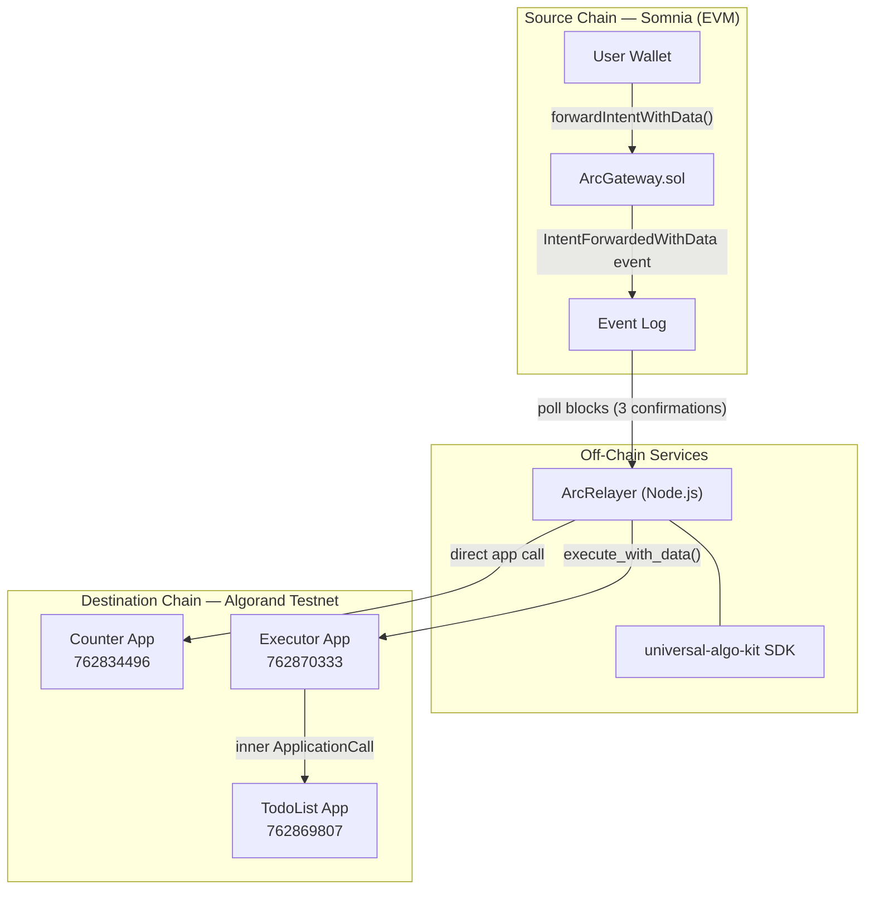
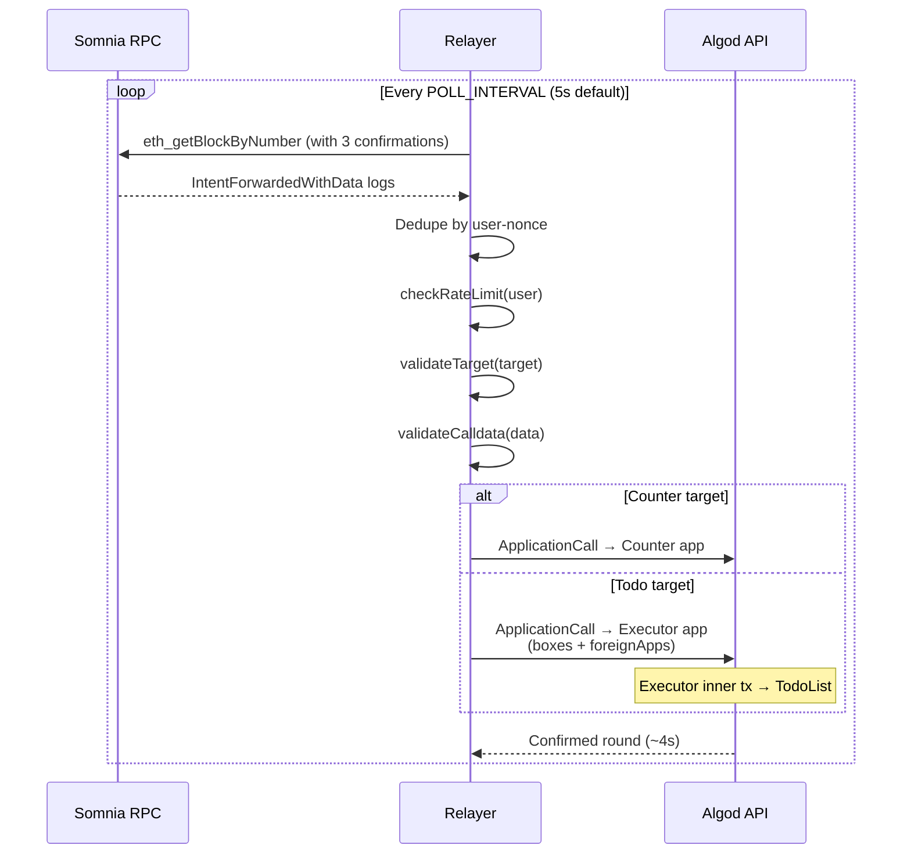
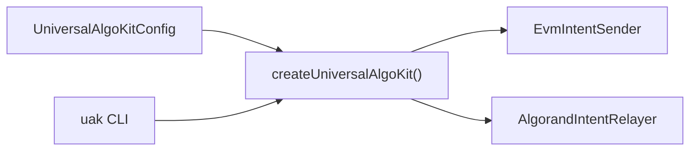
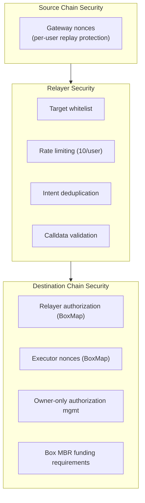

# Technical Architecture — Universal Algorand Kit

This document describes the end-to-end technical architecture of the **Universal Algorand Kit**: a cross-chain intent system that lets users sign transactions on an EVM source chain (Somnia) and settle state changes on Algorand testnet.

---

## 1. System Overview

The kit implements an **intent-based bridge** pattern:

1. A user submits a transaction on Somnia that calls `ArcGateway`.
2. The gateway emits an on-chain event (no destination execution on Somnia).
3. An off-chain **relayer** watches those events, validates them, and submits Algorand application calls.
4. Algorand apps persist the final state on the destination ledger.

**Design goals:**

| Goal | Approach |
|------|----------|
| Sub-5s settlement | Event-driven relayer + direct Algorand app calls |
| Non-custodial UX | User signs only on source chain; relayer pays Algorand fees |
| Extensible targets | Whitelisted EVM address → Algorand app ID mapping |
| Production-grade Todo ops | Executor pattern with authorization, nonces, and inner transactions |

**Supported destination apps:**

| App | Settlement path | State model |
|-----|-----------------|-------------|
| Counter | Relayer → Counter (direct) | Global `UInt64` |
| TodoList | Relayer → Executor → TodoList (inner tx) | Per-user `BoxMap` |

---

## 2. High-Level Architecture



### Layered view

```
┌─────────────────────────────────────────────────────────────────────┐
│  Presentation / Dev Tools                                           │
│  • test-flow.ts, authorize-relayer-final.ts                         │
│  • universal-algo-kit CLI (`uak`)                                   │
└───────────────────────────────┬─────────────────────────────────────┘
                                │
┌───────────────────────────────▼─────────────────────────────────────┐
│  Application Layer (Off-Chain)                                      │
│  • EvmIntentSender — ABI-encode calldata, submit gateway tx         │
│  • AlgorandIntentRelayer — poll events, validate, settle on Algo     │
└───────────────────────────────┬─────────────────────────────────────┘
                                │
        ┌───────────────────────┼───────────────────────┐
        │                       │                       │
┌───────▼────────┐   ┌──────────▼──────────┐   ┌───────▼────────────┐
│ Source Chain   │   │ Relayer Runtime     │   │ Destination Chain  │
│ ArcGateway.sol │   │ ethers + algosdk    │   │ PuyaPy ARC4 apps   │
│ (Solidity)     │   │ rate limit, nonces  │   │ Counter/Todo/Exec  │
└────────────────┘   └─────────────────────┘   └────────────────────┘
```

---

## 3. Repository Structure

```
Universal Algorand Kit/
├── web3-hardhat-intent/          # Reference implementation (Hardhat + relayer)
│   ├── contracts/                # EVM: ArcGateway, Counter, ArcExecutor, Todo
│   ├── relayer/index.ts          # Production relayer service
│   ├── scripts/                  # Deploy, test, authorize utilities
│   └── algorand/                 # Mirror Algorand contract sources
│
├── executor/                     # AlgoKit project (canonical Algorand contracts)
│   └── projects/executor/
│       └── smart_contracts/
│           ├── counter/          # Counter ARC4 app
│           ├── todo/             # TodoList ARC4 app (BoxMap storage)
│           └── executor/         # ArcExecutor orchestrator
│
├── sdk/universal-algo-kit/       # Publishable npm SDK + CLI
│   ├── src/evm/                  # Intent sender, ABIs
│   ├── src/relayer/              # Relayer core, ARC4 encoding
│   └── docs/ARCHITECTURE.md      # SDK-level architecture notes
│
├── src/                          # RemitStar React frontend (Polkadot Hub — separate track)
└── docs/                         # Operational guides (AUTHORIZATION_GUIDE.md, etc.)
```

---

## 4. Component Specifications

### 4.1 Source Chain — `ArcGateway.sol`

**Role:** Stateless intent emitter on Somnia. Holds no assets and performs no cross-chain logic.

**Key behaviors:**

- Maintains per-user `nonces` mapping for replay protection on the source chain.
- Exposes two entry points:
  - `forwardIntent(target)` → emits `IntentForwarded`
  - `forwardIntentWithData(target, data)` → emits `IntentForwardedWithData`
- Event payload: `(user, target, data?, nonce, timestamp)`

**Deployed (Somnia Testnet):**

| Contract | Address |
|----------|---------|
| ArcGateway | `0x96DBFD24b4d6aC9f0D00E9fFb59d7b76C3ae34af` |

### 4.2 Off-Chain Relayer — `web3-hardhat-intent/relayer/index.ts`

**Role:** Bridge operator that converts EVM intent events into Algorand application calls.

**Runtime dependencies:**

| Library | Purpose |
|---------|---------|
| `ethers` v6 | Poll Somnia blocks, decode gateway events |
| `algosdk` | Build, sign, and submit Algorand transactions |

**Processing pipeline:**



**Configuration (`.env`):**

| Variable | Description |
|----------|-------------|
| `SOMNIA_TESTNET_RPC_URL` | Source chain RPC |
| `ARC_GATEWAY_ADDRESS` | Gateway contract |
| `COUNTER_ADDRESS` / `TODO_ADDRESS` | Whitelisted EVM targets |
| `COUNTER_APP_ID` / `TODO_APP_ID` / `EXECUTOR_APP_ID` | Algorand app IDs |
| `ALGORAND_RELAYER_MNEMONIC` | Relayer signing key |
| `ALGORAND_ALGOD_URL` | Algod endpoint |

**Security controls (relayer-side):**

- **Target whitelist** — only `COUNTER_ADDRESS` and `TODO_ADDRESS` accepted
- **Rate limiting** — max 10 intents per user (in-memory)
- **Nonce validation** — rejects duplicate or out-of-order nonces
- **Calldata validation** — rejects malformed ABI data
- **Processed intent set** — deduplication by `{user}-{nonce}`

### 4.3 Destination Chain — Algorand Smart Contracts

All contracts are written in **Algorand Python (PuyaPy)**, compiled to TEAL, and expose **ARC-4 ABI** methods.

#### Counter App

Simple global-state counter. No user identity required.

```python
# Methods
increment() -> UInt64
decrement() -> UInt64
get_counter() -> UInt64  # readonly
```

**Settlement:** Relayer calls Counter directly with ARC4 method selector in `appArgs[0]`.

| App ID | Status |
|--------|--------|
| 762834496 | Production-ready |

#### TodoList App

Per-user todo storage using `BoxMap(Bytes, String)` keyed by `user_bytes + todo_id_bytes`.

```python
add_todo(user: Bytes, todo_id: String, text: String)
remove_todo(user: Bytes, todo_id: String)
get_todo(user: Bytes, todo_id: String) -> String  # readonly
```

**Settlement:** Always routed through Executor (requires box references and inner transaction).

| App ID | Status |
|--------|--------|
| 762869807 | Production-ready |

#### Executor App (`ArcExecutor`)

Orchestrator for parameterized, user-scoped operations.

**On-chain state:**

| Storage | Key prefix | Value | Purpose |
|---------|------------|-------|---------|
| `relayers` | `relayer_` | `arc4.Bool` | Authorized relayer addresses |
| `nonces` | `nonce_` | `UInt64` | Per-user replay protection |

**Key methods:**

```python
set_relayer_authorization(relayer: Account, authorized: arc4.Bool)  # owner only
execute(user: Account, target_app: UInt64)                          # no-arg inner call
execute_with_data(user, target_app, method_selector, arg1, arg2, arg3)  # parameterized
get_nonce(user: Account) -> UInt64                                  # readonly
is_relayer_authorized(relayer: Account) -> arc4.Bool                  # readonly
```

**Authorization model:**

- Contract **owner** (deployer) can always execute.
- Relayers must be explicitly authorized via `set_relayer_authorization`.
- ARC4 bool `true` is encoded as `0x80` (not `0x01`).

| App ID | Status |
|--------|--------|
| 762870333 | Production-ready |

---

## 5. Settlement Paths

### 5.1 Counter — Direct Path

Used when the target operation has no user-specific parameters and needs minimal latency.

```
User (Somnia)
  → ArcGateway.forwardIntentWithData(counterAddr, incrementCalldata)
  → IntentForwardedWithData event
  → Relayer decodes calldata → ARC4 selector 0x4a325901 (increment)
  → Algorand ApplicationCall(appId=762834496, appArgs=[selector])
  → Counter.counter += 1
```

**Why direct?** Lower fee, fewer box references, no authorization gate on Executor.

### 5.2 TodoList — Executor Path

Used when operations require per-user state isolation, box storage, and relayer authorization.

```
User (Somnia)
  → ArcGateway.forwardIntentWithData(todoAddr, addTodoCalldata)
  → IntentForwardedWithData event
  → Relayer:
      1. Map EVM user address → 32-byte Algorand identity
      2. Build Todo inner args (selector + ARC4-encoded params)
      3. Wrap in Executor execute_with_data(...)
      4. Attach box refs: relayer auth, user nonce, todo box
      5. Set foreignApps = [TODO_APP_ID]
      6. Set flatFee = 2000 µAlgos (covers inner tx fee)
  → Executor validates relayer authorization
  → Executor increments user nonce
  → Executor inner ApplicationCall → TodoList.add_todo(...)
  → Todo box created/updated on ledger
```

**Why Executor?**

- Centralized relayer authorization (owner-controlled allowlist)
- Per-user nonce tracking prevents replay on Algorand
- Inner transactions enable composable, multi-app calls
- Box reference management for cross-app storage access

---

## 6. Cross-Chain Identity & Encoding

### User identity mapping

EVM addresses (20 bytes) are left-padded to 32 bytes for Algorand apps:

```
[ 0x00 × 12 | EVM address (20 bytes) ]
```

This allows Somnia users to be identified on Algorand without creating Algorand accounts per user.

### ARC-4 method selectors

Selectors are the first 4 bytes of `SHA-512/256(method_signature)`:

| Contract | Method | Selector |
|----------|--------|----------|
| Counter | `increment()uint64` | `0x4a325901` |
| Counter | `decrement()uint64` | `0xdae6e4ce` |
| TodoList | `add_todo(byte[],string,string)void` | `0xbc6d3057` |
| TodoList | `toggle_todo(byte[],string)void` | `0x0ed5af56` |
| TodoList | `delete_todo(byte[],string)void` | `0x865ba9be` |
| Executor | `execute_with_data(...)` | `0x995334be` |
| Executor | `set_relayer_authorization(address,bool)` | `0x0315e8ce` |

### ARC-4 type encoding rules

| Type | Encoding |
|------|----------|
| `bool` | `0x80` = true, `0x00` = false |
| `address` / `account` | Raw 32 bytes |
| `uint64` | 8 bytes big-endian |
| `byte[]` | 2-byte length prefix + data |
| `string` | 2-byte length prefix + UTF-8 bytes |

Arguments to TodoList methods are passed **individually** through Executor (not concatenated into a single blob).

---

## 7. SDK Architecture — `universal-algo-kit`

The SDK extracts the reference relayer into a publishable package.



**Public API surface:**

```typescript
const uak = createUniversalAlgoKit(config);
await uak.sender.forwardCounterIntent(signer, "increment");
await uak.relayer.start();  // blocking poll loop
```

**Module layout:**

| Module | Responsibility |
|--------|----------------|
| `src/evm/sender.ts` | Gateway transactions, ABI encoding |
| `src/evm/abis.ts` | Gateway + target contract ABIs |
| `src/relayer/relayer.ts` | Event polling, settlement logic |
| `src/relayer/arc4.ts` | Selector hashing, parameter encoding |
| `src/relayer/address.ts` | EVM → Algorand address conversion |
| `src/cli.ts` | `uak relayer` / `uak send` commands |

See also: `sdk/universal-algo-kit/docs/ARCHITECTURE.md`

---

## 8. Security Architecture



| Threat | Mitigation | Layer |
|--------|------------|-------|
| Replay on Somnia | Gateway `nonces` mapping | Source |
| Replay on Algorand | Executor per-user nonce boxes | Destination |
| Unauthorized relayer | `set_relayer_authorization` + on-chain check | Destination |
| Spam / DoS | Relayer rate limiting | Off-chain |
| Wrong target app | Whitelisted EVM addresses only | Off-chain |
| Malformed calldata | Relayer calldata validation | Off-chain |
| Inner tx fee failure | Outer tx flat fee = 2000 µAlgos | Destination |

**Known MVP limitations:**

- Single centralized relayer (no consensus or slashing)
- No cryptographic proof of source-chain inclusion on Algorand
- Relayer nonce/rate-limit state is in-memory (not persisted across restarts)
- No intent cancellation or timeout mechanism

---

## 9. Deployment Topology

### Network endpoints

| Network | RPC / API | Chain ID |
|---------|-----------|----------|
| Somnia Testnet | `https://dream-rpc.somnia.network/` | 50312 |
| Algorand Testnet (Algod) | `https://testnet-api.algonode.cloud` | — |
| Algorand Testnet (Indexer) | `https://testnet-idx.algonode.cloud` | — |

### Operational accounts

| Account | Role | Address |
|---------|------|---------|
| Relayer | Signs Algorand settlement txs | `MBZRAQJZPHSNISYKVZVJZLOIXI3PPX2CRHGLKZMBSBVSV2FU6FRULGIIJA` |
| Deployer / Owner | Authorizes relayers, deploys apps | `62NPUZXFM7A4LQONLOBLH5RSYOT6YQJXWJBM3O6ABIZROBO2DHVVRUHKAE` |

### One-time setup flow

1. Deploy Algorand apps via AlgoKit (`algokit project deploy testnet`)
2. Deploy `ArcGateway` on Somnia (`scripts/deploy-gateway.ts`)
3. Fund relayer account (~2 ALGO for fees)
4. Fund deployer account (~2 ALGO for authorization + box MBR)
5. Run `scripts/authorize-relayer-final.ts` to set relayer auth box
6. Start relayer: `npm run relayer`

See: [AUTHORIZATION_GUIDE.md](./AUTHORIZATION_GUIDE.md)

---

## 10. Performance Characteristics

| Stage | Typical latency |
|-------|-----------------|
| Event detection (3 confirmations) | ~1–2 s |
| Relayer validation + tx build | 100–500 ms |
| Algorand block confirmation | 3–5 s |
| **End-to-end** | **4–6 s** |

Measured success rate on testnet: **100%** for Counter and TodoList flows (see [SUCCESS_REPORT.md](./SUCCESS_REPORT.md)).

---

## 11. Technology Stack

| Layer | Technology |
|-------|------------|
| Source contracts | Solidity 0.8.30, Hardhat |
| Destination contracts | Algorand Python (PuyaPy), AlgoKit CLI |
| Relayer / SDK | TypeScript, Node.js 18+, ethers v6, algosdk v2 |
| Contract compilation | Puya → TEAL → ARC-56 artifacts |
| Testing | Hardhat tests, AlgoKit integration tests |
| Frontend (separate) | React 18, Vite, Wagmi, Tailwind (RemitStar track) |

---

## 12. Extension Points

To add a new destination app:

1. **Deploy** a new ARC-4 Algorand app under `executor/projects/executor/smart_contracts/`.
2. **Register** an EVM placeholder address in `config/addresses.ts` and `.env`.
3. **Choose settlement path:**
   - Simple/no user state → direct relayer app call (Counter pattern)
   - User-scoped/box storage → Executor inner call (TodoList pattern)
4. **Update relayer routing** in `relayer/index.ts` (or SDK `relayer.ts`).
5. **Add ARC4 selectors** and encoding logic.
6. **Authorize relayer** if using Executor path.

---

## 13. Related Documentation

| Document | Contents |
|----------|----------|
| [README.md](./README.md) | Quick start, testing, debugging |
| [AUTHORIZATION_GUIDE.md](./AUTHORIZATION_GUIDE.md) | Relayer authorization steps |
| [SUCCESS_REPORT.md](./SUCCESS_REPORT.md) | Resolved issues and test results |
| [COMPLETION_SUMMARY.md](./COMPLETION_SUMMARY.md) | Phase-by-phase implementation status |
| [sdk/universal-algo-kit/README.md](./sdk/universal-algo-kit/README.md) | SDK install and API reference |
| [sdk/universal-algo-kit/docs/ARCHITECTURE.md](./sdk/universal-algo-kit/docs/ARCHITECTURE.md) | SDK transaction flow details |

---

**Status:** Production-ready on Algorand + Somnia testnets  
**Version:** 1.0.0  
**Last updated:** June 2026
