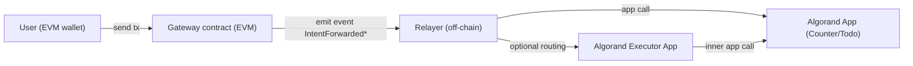

# universal-algo-kit

Universal Algo Kit (UAK) is a TypeScript **SDK + CLI** for **cross-chain intents**:

- **Source chain**: EVM (Somnia / any Ethereum-compatible chain)
- **Destination chain**: Algorand (settlement via Algorand app calls)

It provides:

- An **intent sender** (EVM tx → emits intent events)
- An **Algorand relayer** (watches EVM events → settles corresponding Algorand app calls)
- A small **CLI** (`uak`) for running the relayer and sending sample intents

This package is extracted from the working reference implementation in this repo (`web3-hardhat-intent/`) and is meant to be published as a standalone SDK.

## Contents

- [Install](#install)
- [Architecture](#architecture)
- [Transaction flow](#transaction-flow)
- [Architecture doc](#architecture-doc)
- [Quick start (SDK)](#quick-start-sdk)
- [Quick start (CLI)](#quick-start-cli)
- [Configuration](#configuration)
- [Supported intents](#supported-intents)
- [API reference](#api-reference)
- [Troubleshooting](#troubleshooting)
- [Security model](#security-model)
- [Deployment note](#deployment-note)
- [Publishing (npm)](#publishing-npm)

## Install

```bash
npm i universal-algo-kit
```

## Architecture

### High-level components



### Roles

- **User**: sends an EVM transaction that encodes the intent.
- **Gateway (EVM)**: emits an event containing `user`, `target`, `nonce`, and optional calldata bytes.
- **Relayer (off-chain)**: watches gateway events and performs Algorand settlement transactions.
- **Algorand apps**:
  - **Counter**: direct settlement (no executor)
  - **Todo**: settlement via **Executor** (for inner tx + authorization / nonce tracking pattern)

## Transaction flow

### 1) EVM intent emission

The sender calls one of the gateway methods:

- `requestIntent(target, data)` → emits `IntentForwarded(...)`
- `forwardIntentWithData(target, data)` → emits `IntentForwardedWithData(..., data, ...)`

UAK uses `ethers` to ABI-encode calldata for Counter/Todo intents and submits a normal EVM transaction.

### 2) Relayer event polling

The relayer:

1. Polls EVM blocks (default `lookback=50`, `confirmations=3`)
2. Reads gateway events in the safe range
3. For each event:
   - validates that `target` is allowed
   - maps `target` (EVM address) → `appId` (Algorand)
   - converts `user` (EVM address) into a 32-byte value used by Algorand apps
   - builds Algorand `appArgs` matching ARC4 method selectors expected by your Algorand apps

### 3) Algorand settlement

There are two settlement paths:

#### Counter (direct app call)

The relayer calls the Counter Algorand app directly with an ARC4 selector:

- `increment()uint64` or `decrement()uint64`

#### Todo (via Executor)

The relayer calls the Executor app which performs an **inner transaction** to the Todo app:

1. Build Todo inner args (`add_todo`, `toggle_todo`, `delete_todo`)
2. Wrap them into Executor call args (`execute_with_data(...)`)
3. Provide box references (relayer auth box, user nonce box, todo box) and include Todo app in `foreignApps`

Fee note: Executor path sets a higher flat fee to cover inner transaction fees (currently `2000` microAlgos in the SDK).

## Architecture doc

More detailed notes live in:

- `sdk/universal-algo-kit/docs/ARCHITECTURE.md`

## Quick start (SDK)

```ts
import { createUniversalAlgoKit } from "universal-algo-kit";

const uak = createUniversalAlgoKit({
  evm: {
    rpcUrl: process.env.SOMNIA_TESTNET_RPC_URL!,
    gatewayAddress: process.env.ARC_GATEWAY_ADDRESS!,
    privateKey: process.env.PRIVATE_KEY, // required to SEND intents
  },
  algorand: {
    algodUrl: process.env.ALGORAND_ALGOD_URL!,
    indexerUrl: process.env.ALGORAND_INDEXER_URL,
    relayerMnemonic: process.env.ALGORAND_RELAYER_MNEMONIC!, // required to SETTLE intents
  },
  targets: {
    counterAddress: process.env.COUNTER_ADDRESS,
    todoAddress: process.env.TODO_ADDRESS,
  },
  appIds: {
    counterAppId: Number(process.env.COUNTER_APP_ID),
    todoAppId: Number(process.env.TODO_APP_ID),
    executorAppId: Number(process.env.EXECUTOR_APP_ID),
  },
  relayer: {
    pollIntervalMs: 5000,
    confirmations: 3,
    lookbackBlocks: 50,
    maxRetries: 3,
  },
});

// Send an intent on EVM (example: Counter.increment)
await uak.sender.sendCounterIncrement();

// Start the relayer loop to settle intents on Algorand
await uak.relayer.start();
```

## Quick start (CLI)

```bash
# Starts the relayer loop (reads .env in current dir)
npx uak relayer
```

Poll once and exit:

```bash
npx uak relayer --once
```

Send example intents:

```bash
npx uak send-counter
npx uak send-todo-add --text "hello"
npx uak send-todo-toggle --id 1
npx uak send-todo-delete --id 1
```

## Configuration

UAK supports config via:

- explicit `createUniversalAlgoKit({...})`
- `process.env` via the CLI (`dotenv` loaded automatically)

### Required env vars

For **sending intents (EVM)**:

- `SOMNIA_TESTNET_RPC_URL` (or `EVM_RPC_URL`)
- `ARC_GATEWAY_ADDRESS`
- `PRIVATE_KEY` (sender)
- `COUNTER_ADDRESS` and/or `TODO_ADDRESS`

For **relaying/settlement (Algorand)**:

- `ALGORAND_ALGOD_URL`
- `ALGORAND_RELAYER_MNEMONIC`
- `COUNTER_APP_ID` and/or `TODO_APP_ID`
- `EXECUTOR_APP_ID` (required if using `TODO_ADDRESS`)

Recommended:

- `ALGORAND_INDEXER_URL`

### Optional relayer tuning

- `RELAYER_POLL_INTERVAL` (ms, default `5000`)
- `RELAYER_CONFIRMATIONS` (default `3`)
- `RELAYER_LOOKBACK_BLOCKS` (default `50`)
- `RELAYER_MAX_RETRIES` (default `3`)

## Supported intents

### Counter

- `increment()`
- `decrement()`

### Todo

- `addTodo(string)`
- `toggleTodo(uint256)`
- `deleteTodo(uint256)`

## API reference

### `createUniversalAlgoKit(config)`

Returns:

- `sender`: `EvmIntentSender`
- `relayer`: `AlgorandIntentRelayer`

### `EvmIntentSender`

- `sendCounterIncrement()`
- `sendTodoAdd(text: string)`
- `sendTodoToggle(id: bigint)`
- `sendTodoDelete(id: bigint)`

### `AlgorandIntentRelayer`

- `init()` (called by `start()`)
- `start()` (infinite loop)
- `pollOnce()` (one polling iteration)

## Troubleshooting

### `403 ... Two-factor authentication ... is required to publish packages`

Your npm account/org requires 2FA for publishing. Publish with OTP or use a granular token with “bypass 2FA for publishing”.

### Relayer starts but never sees events

- Ensure `SOMNIA_TESTNET_RPC_URL` points to the correct chain
- Ensure `ARC_GATEWAY_ADDRESS` is the deployed gateway on that chain
- Increase `RELAYER_LOOKBACK_BLOCKS` temporarily if events are older than the default lookback

### Algorand tx fails (logic eval / missing boxes)

- Confirm `COUNTER_APP_ID`, `TODO_APP_ID`, `EXECUTOR_APP_ID` match the deployed apps
- Ensure the Executor app is funded (box storage + fees)
- Ensure the relayer account is authorized in the Executor app (your app logic)

## Security model

This SDK is a reference implementation and should be treated as such.

Key assumptions:

- The relayer is trusted to submit settlement transactions.
- The relayer only settles intents to configured/allowed targets.

Hardening checklist for production:

- Persist intent processing state (avoid duplicates across relayer restarts)
- Add stronger replay protection (read and verify nonce state from chain, not in-memory)
- Add allowlist/denylist rules per target and per method selector
- Add structured logging + monitoring + alerting

## Deployment note

This SDK focuses on **intent sending** + **relaying**. Contract/app deployment is still handled by the reference projects in this repo:

- EVM contracts + gateway: `web3-hardhat-intent/`
- Algorand apps (Counter/Todo/Executor): `executor/`

## Publishing (npm)

From `sdk/universal-algo-kit/`:

```bash
npm run build
npm publish --access public
```

Before publishing, update:

- `sdk/universal-algo-kit/package.json` (`name`, `version`, `repository.url`, `author`)
