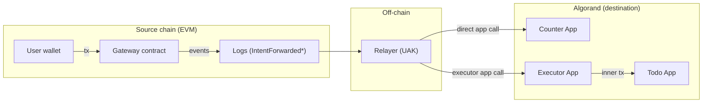

# Architecture and transaction flow

This document explains the end-to-end data flow used by `universal-algo-kit` (UAK) and how it maps EVM intent events to Algorand app calls.

## Terms

- **Intent**: a request created on an EVM chain that should be settled on Algorand.
- **Gateway**: EVM contract that emits intent events.
- **Relayer**: off-chain service that watches EVM events and submits Algorand settlement transactions.
- **Target**: EVM address that identifies which “app” the intent is meant for (Counter / Todo in the reference implementation).

## Component diagram

## Intent event fields

UAK expects gateway events with at least:

- `user` (EVM address)
- `target` (EVM address)
- `nonce` (monotonic per-user on EVM)
- optional `data` (ABI calldata bytes)

UAK currently supports the gateway ABI declared in `src/evm/abis.ts`.

## EVM → Algorand mapping

### Target mapping

The relayer maps:

`target (EVM address)` → `Algorand appId`

This is configured via:

- `targets.counterAddress` + `appIds.counterAppId`
- `targets.todoAddress` + `appIds.todoAppId`

### User mapping

Algorand apps in the reference implementation use a 32-byte user identifier.

UAK converts the 20-byte EVM address into 32 bytes by left-padding with zeros:

`[ 12 bytes of 0x00 | 20-byte EVM address ]`

See: `src/relayer/address.ts`.

## Settlement paths

### Counter: direct app call

Counter intents are settled by calling the Counter Algorand app directly with an ARC4 method selector in `appArgs[0]`.

Selector hashing is defined by:

`selector = sha512-256(signature)[0..4]`

See: `src/relayer/arc4.ts`.

### Todo: via Executor (inner transaction)

Todo intents route through the Executor app because the reference implementation uses:

- relayer authorization
- nonce tracking
- inner transaction call into the Todo app
- box storage for per-user todo state

The relayer:

1. Parses Todo calldata from the EVM event
2. Builds Todo inner method selector + args
3. Wraps it into an Executor `execute_with_data(...)` call
4. Supplies required `boxes` and `foreignApps`

Fee note: executor settlement uses a flat fee of `2000` microAlgos to cover inner transaction fees.

## Operational notes

- The provided relayer is a polling loop. You can embed it in a worker process or run it as a standalone service.
- For production use, persist processed intent IDs and validate nonces against on-chain state (not just in-memory).

